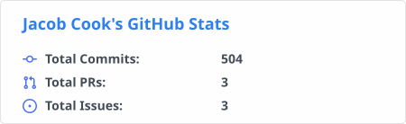

  

<h1 align="center">Jacob Cook</h1>

<b>Detection &amp; Security Automation Engineer</b>

  
  &nbsp;
  
  &nbsp;
  

  
  
  
  
  

I build **reliable triage from noisy telemetry** — behavioral **Sigma** detections, **SIEM** tuning, **identity** attack detection, and **SOAR** automation — each documented with real false-positive scenarios and repeatable response playbooks.

Currently a Service Desk Analyst moving toward a blue-team / detection role, and pursuing an **MS in Cybersecurity** at Western Governors University (expected **October 2026**).

## Tech & tooling

**Languages & frameworks**

  
  
  
  
  
  
  

**Security, cloud & infrastructure**

  
  
  
  
  
  
  
  
  

## Detection engineering & blue team

**Featured — [Stryker / Intune Detection Pack](https://github.com/jacobdcook/stryker-intune-detection-pack)** — Detection-as-code for Intune MDM abuse, modeled on the 2026 Stryker/Handala attack: Sigma rules, KV-store enrichment, and response playbooks mapped to MITRE ATT&CK.

| 
<b>Blue Team SOC Monitoring Lab</b>
 | 
<b>SOAR-lite — IR Orchestrator</b>
 | 
<b>Network Behavior Analyzer</b>
 |
| :---: | :---: | :---: |
| 
 Wazuh SIEM stack (Docker) with Linux log ingestion, brute-force detection, and documented alert triage + rule IDs <a href="https://github.com/jacobdcook/blue-team-soc-monitoring-lab">Project Link</a>
 | 
 Lightweight SOAR that ingests SIEM alerts and runs automated response playbooks for common threats <a href="https://github.com/jacobdcook/soar-incident-orchestrator">Project Link</a>
 | 
 Detects C2 beaconing and data exfiltration through network behavioral analysis (LLM-assisted summaries) <a href="https://github.com/jacobdcook/network-behavior-analyzer">Project Link</a>
 |

More detection work:

- **[Okta Detection Engine](https://github.com/jacobdcook/okta-detection-engine)** — Python detections for identity attacks: MFA fatigue, impossible travel, and more.
- **[Phishing Analysis Lab](https://github.com/jacobdcook/Phishing-Analysis-Lab)** — End-to-end phishing triage: header inspection, link extraction, VirusTotal enrichment, analyst reports.
- **[AWS Identity Detection Lab](https://github.com/jacobdcook/aws-identity-detection-lab)** — CloudTrail-style detection scenarios with pytest-backed detection logic.
- **[Security+ Learning Lab](https://github.com/jacobdcook/security-plus-labs)** · **[TCM SOC 101 Notes](https://github.com/jacobdcook/tcm-soc-101-lab-notes)** — Hands-on labs and course notes.

## Cloud & infrastructure security

| 
<b>Cloud Infrastructure Security Auditor</b>
 | 
<b>Azure Cloud Hardening Lab</b>
 |
| :---: | :---: |
| 
 Static analysis + live Azure auditing for Terraform and cloud misconfigurations, with a remediation-oriented workflow <a href="https://github.com/jacobdcook/cloud-security-auditor">Project Link</a>
 | 
 Hardened, secure Azure infrastructure deployed with Terraform <a href="https://github.com/jacobdcook/Azure-Cloud-Hardening-Lab">Project Link</a>
 |

## AI & security tooling

Where I lean on LLMs as a force-multiplier for security and productivity work:

| 
<b>G3-GPT — Document Retrieval</b>
 | 
<b>AI Log Auditor</b>
 | 
<b>Synapse AI Chat</b>
 |
| :---: | :---: | :---: |
| 
 RAG platform with Azure SSO and role-based access control for enterprise document retrieval <a href="https://github.com/jacobdcook/G3-GPT">Project Link</a>
 | 
 Log-analysis pipeline with automated PDF reporting and LLM-assisted triage summaries <a href="https://github.com/jacobdcook/ai-log-auditor">Project Link</a>
 | 
<a href="https://github.com/jacobdcook/synapse">   </a> Multi-model desktop chat client for local Ollama models <a href="https://github.com/jacobdcook/synapse">Project Link</a>
 |

Also: **[Whisper Transcribe](https://github.com/jacobdcook/whisper-transcribe)** (local faster-whisper + CUDA transcription) · **[Claude Code Skills](https://github.com/jacobdcook/claude-skills)** (reusable Claude Code skill packs).

## Education & certifications

* **Master's in Cybersecurity** — Western Governors University (Expected October 2026)
* **B.S. in Computer Science** — California State University, Sacramento
* **CompTIA SecurityX (CAS-005)** — 2026
* **CompTIA PenTest+ (PT0-003)** — 2026
* **CompTIA CySA+ (CS0-003)** — Feb 2026
* **CompTIA Security+ (SY0-701)** — Jan 2026
* **CompTIA CSIE** (Secure Infrastructure Expert) — stackable credential

## GitHub stats

<!-- Stats card is generated by .github/workflows/update-stats.yml and stored in-repo so it always loads (no external fetch). -->

