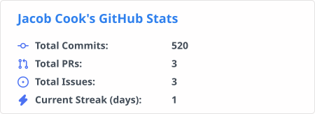

  

<h1 align="center">Jacob Cook</h1>

<b>Software Engineering · Security Automation · Internal Tools</b>

  

  
  &nbsp;
  
  &nbsp;
  

  
  
  
  
  
  

I build software for security and internal business workflows. My day job is **Service Desk Analyst at Williams-Sonoma**, supporting hardware, software, POS, and network issues across 600+ retail stores.

My personal projects cover Python APIs, identity detections, security automation, and desktop tools. Current lab work combines **PostgreSQL**, alert triage, and synthetic employee onboarding and rehire scenarios. These projects are separate from employer systems and use lab data.

**BS Computer Science, Sacramento State. MS Cybersecurity and Information Assurance, WGU, completed 2026.** Based in Sacramento and interested in software engineering for internal tools, backend development, security automation, and identity-focused roles.

## What I build

| Claim | Evidence |
| --- | --- |
| **Detection-as-code** — Sigma rules mapped to MITRE ATT&CK, modeled on real incidents | [Stryker / Intune Detection Pack](https://github.com/jacobdcook/stryker-intune-detection-pack) |
| **SIEM deployment & tuning** — Wazuh stack with documented alert triage and rule IDs | [Blue Team SOC Monitoring Lab](https://github.com/jacobdcook/blue-team-soc-monitoring-lab) |
| **Identity attack detection** — MFA fatigue, impossible travel, CloudTrail scenarios | [Okta Detection Engine](https://github.com/jacobdcook/okta-detection-engine) · [AWS Identity Detection Lab](https://github.com/jacobdcook/aws-identity-detection-lab) |
| **SOAR automation** — alert ingestion driving automated response playbooks | [SOAR-lite IR Orchestrator](https://github.com/jacobdcook/soar-incident-orchestrator) |
| **Cloud misconfiguration auditing** — Terraform static analysis + live Azure checks | [Cloud Security Auditor](https://github.com/jacobdcook/cloud-security-auditor) · [Azure Hardening Lab](https://github.com/jacobdcook/Azure-Cloud-Hardening-Lab) |
| **Local voice & dev productivity** — push-to-talk input + spoken CLI output, no cloud TTS | [Voxflow](https://github.com/jacobdcook/voxflow) · [Murmur](https://github.com/jacobdcook/murmur) |
| **Desktop product shipping** — cross-platform beta builds with private source | [CareerHound releases](https://github.com/jacobdcook/careerhound-releases) |

**How I approach the work:**

- A detection without documented false positives is just future noise.
- Keep changes in version control and check behavior with repeatable tests.
- Automate repeated steps and make failures visible to the person responsible.

## Recently shipped

<!-- RECENT-WORK:START -->
- **[portfolio](https://github.com/jacobdcook/portfolio/commit/c65450393c28f50a237ade6da91ddbaed202e861)** — Align portfolio and resume with software and security engineering focus · *Oct 8, 2026*
- **[stryker-intune-detection-pack](https://github.com/jacobdcook/stryker-intune-detection-pack/commit/cd571d44fa28f5585d4641c7ae2f2b967d795a7d)** — Match Stryker statement wording in README · *Oct 3, 2026*
- **[stryker-intune-detection-pack](https://github.com/jacobdcook/stryker-intune-detection-pack/commit/2b210c6cb4db7137b3793efcdd39cf891e93dcdb)** — Frame Stryker figures as attacker claims and add citations · *Oct 3, 2026*
- **[aws-identity-detection-lab](https://github.com/jacobdcook/aws-identity-detection-lab/commit/8945aee48e37a8e29d9c6215121d28e777e128a0)** — Genericize detection framing line in README · *Oct 3, 2026*
- **[cloud-security-auditor](https://github.com/jacobdcook/cloud-security-auditor/commit/39441fb35747e94c7ce2419e790dc8f06d9a56c1)** — Add secret-free .env.example template · *Oct 3, 2026*
<!-- RECENT-WORK:END -->

Auto-updated daily by [a GitHub Actions workflow](.github/workflows/update-stats.yml) — the same detection-as-code habit, applied to this page.

## Tech & tooling

**Languages & frameworks**

  
  
  
  
  
  
  

**Security, cloud & infrastructure**

  
  
  
  
  
  
  
  
  

## Detection engineering & blue team

**Featured — [Stryker / Intune Detection Pack](https://github.com/jacobdcook/stryker-intune-detection-pack)** — Detection-as-code for Intune MDM abuse, modeled on the 2026 Stryker/Handala attack: Sigma rules, KV-store enrichment, and response playbooks mapped to MITRE ATT&CK.

<table><tr>
<td align="center" valign="top" width="33%"><a href="https://github.com/jacobdcook/blue-team-soc-monitoring-lab"><b>Blue Team SOC Monitoring Lab</b></a>   Wazuh SIEM stack (Docker) with Linux log ingestion, brute-force detection, and documented alert triage + rule IDs <a href="https://github.com/jacobdcook/blue-team-soc-monitoring-lab">Project Link</a></td>
<td align="center" valign="top" width="33%"><a href="https://github.com/jacobdcook/soar-incident-orchestrator"><b>SOAR-lite — IR Orchestrator</b></a>   Lightweight SOAR that ingests SIEM alerts and runs automated response playbooks for common threats <a href="https://github.com/jacobdcook/soar-incident-orchestrator">Project Link</a></td>
<td align="center" valign="top" width="33%"><a href="https://github.com/jacobdcook/network-behavior-analyzer"><b>Network Behavior Analyzer</b></a>   Detects C2 beaconing and data exfiltration through network behavioral analysis (LLM-assisted summaries) <a href="https://github.com/jacobdcook/network-behavior-analyzer">Project Link</a></td>
</tr></table>

More detection work:

- **[Okta Detection Engine](https://github.com/jacobdcook/okta-detection-engine)** — Python detections for identity attacks: MFA fatigue, impossible travel, and more.
- **[Phishing Analysis Lab](https://github.com/jacobdcook/Phishing-Analysis-Lab)** — End-to-end phishing triage: header inspection, link extraction, VirusTotal enrichment, analyst reports.
- **[AWS Identity Detection Lab](https://github.com/jacobdcook/aws-identity-detection-lab)** — CloudTrail-style detection scenarios with pytest-backed detection logic.
- **[Security+ Learning Lab](https://github.com/jacobdcook/security-plus-labs)** · **[TCM SOC 101 Notes](https://github.com/jacobdcook/tcm-soc-101-lab-notes)** — Hands-on labs and course notes.

## Cloud & infrastructure security

<table><tr>
<td align="center" valign="top" width="50%"><a href="https://github.com/jacobdcook/cloud-security-auditor"><b>Cloud Infrastructure Security Auditor</b></a>   Static analysis + live Azure auditing for Terraform and cloud misconfigurations, with a remediation-oriented workflow <a href="https://github.com/jacobdcook/cloud-security-auditor">Project Link</a></td>
<td align="center" valign="top" width="50%"><a href="https://github.com/jacobdcook/Azure-Cloud-Hardening-Lab"><b>Azure Cloud Hardening Lab</b></a>   Hardened, secure Azure infrastructure deployed with Terraform <a href="https://github.com/jacobdcook/Azure-Cloud-Hardening-Lab">Project Link</a></td>
</tr></table>

## AI & security tooling

Where I lean on LLMs as a force-multiplier for security and productivity work:

<table><tr>
<td align="center" valign="top" width="33%"><a href="https://github.com/jacobdcook/G3-GPT"><b>G3-GPT — Document Retrieval</b></a>   RAG platform with Azure SSO and role-based access control for enterprise document retrieval <a href="https://github.com/jacobdcook/G3-GPT">Project Link</a></td>
<td align="center" valign="top" width="33%"><a href="https://github.com/jacobdcook/ai-log-auditor"><b>AI Log Auditor</b></a>   Log-analysis pipeline with automated PDF reporting and LLM-assisted triage summaries <a href="https://github.com/jacobdcook/ai-log-auditor">Project Link</a></td>
<td align="center" valign="top" width="33%"><a href="https://github.com/jacobdcook/synapse"><b>Synapse AI Chat</b></a>   Multi-model desktop chat client for local Ollama models <a href="https://github.com/jacobdcook/synapse">Project Link</a></td>
</tr></table>

Also: **[Whisper Transcribe](https://github.com/jacobdcook/whisper-transcribe)** (local faster-whisper + CUDA transcription) · **[Claude Code Skills](https://github.com/jacobdcook/claude-skills)** (reusable Claude Code skill packs).

<table><tr>
<td align="center" valign="top" width="33%"><a href="https://github.com/jacobdcook/voxflow"><b>Voxflow</b></a>   Hold a key, speak, release. Local, cross-platform push-to-talk dictation (open-source Wispr Flow alternative) <a href="https://github.com/jacobdcook/voxflow">Project Link</a></td>
<td align="center" valign="top" width="33%"><a href="https://github.com/jacobdcook/murmur"><b>Murmur</b></a>   Streaming Kokoro TTS for Claude Code: music ducking, tray controls, hold-to-pause hotkeys, sentence-level playback <a href="https://github.com/jacobdcook/murmur">Project Link</a></td>
<td align="center" valign="top" width="33%"><a href="https://github.com/jacobdcook/claude-skills"><b>Claude Code Skills</b></a>   Reusable skill packs for session memory, wrap-up, and multi-system agent workflows <a href="https://github.com/jacobdcook/claude-skills">Project Link</a></td>
</tr></table>

## Products (beta)

**[CareerHound](https://github.com/jacobdcook/careerhound-releases)** — desktop career workflow app (LinkedIn export import, draft review, manual-send queue). Source is private during beta; public Windows/macOS/Linux builds live in [careerhound-releases](https://github.com/jacobdcook/careerhound-releases).

## Education & certifications

| Credential | Issuer | When |
| --- | --- | --- |
| **M.S. Cybersecurity & Information Assurance** | Western Governors University | Completed 2026 |
| **B.S. Computer Science** | California State University, Sacramento | Completed |
| **SecurityX (CAS-005)** | CompTIA | 2026 |
| **PenTest+ (PT0-003)** | CompTIA | 2026 |
| **CySA+ (CS0-003)** | CompTIA | Feb 2026 |
| **Security+ (SY0-701)** | CompTIA | Jan 2026 |
| **CSIE** (Secure Infrastructure Expert) | CompTIA | Stackable credential |
| **CSAP** (Security Analytics Professional) | CompTIA | Stackable credential (Security+ · CySA+) |

## GitHub stats

<!-- Stats card is generated by .github/workflows/update-stats.yml and stored in-repo so it always loads (no external fetch). -->

---

  <a href="https://www.linkedin.com/in/jcook-dev">LinkedIn</a> ·
  <a href="https://jacobdcook.com">Portfolio</a> ·
  <a href="https://www.jacobdcook.com/resume.pdf">Resume</a>

